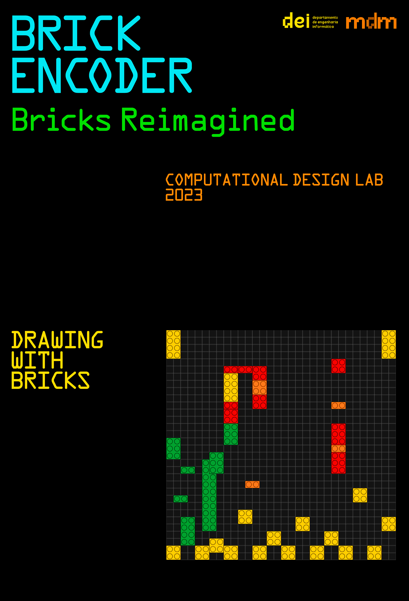
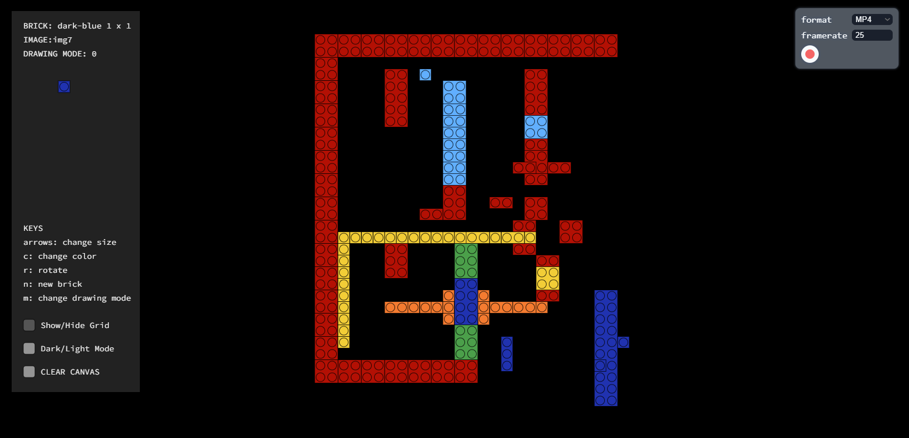
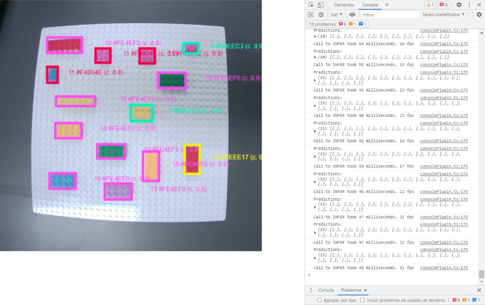
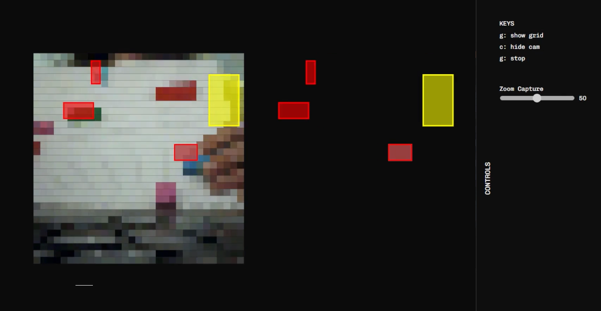

# Watch the video

# Structure of code & Video of the process
**Digital Legos**
-
Using [p5.js](https://p5js.org/)

This is the main code we developed. We experimented with several drawing modes and went with the first one we created. I want to start this one over with functionalities that aid in the type design process (guides, grids, etc.). 
Thank you to all professors that guided us in this direction. Digital 2D legos are also cool :)
 
  

**Object Detection**
-
Using [Roboflow](https://universe.roboflow.com/) and [p5.js](https://p5js.org/) 

This code reflects our attempt at going tangible with legos using object detection. Thank you to professor Sérgio Rebelo ((👋)) for taking the time to provide this code, allowing us to try out image classification and object detection. We learned a lot using Roboflow, loved the image classification process, and will CERTAINLY use this knowledge in the future.

**Color Tracking**
-
Using [p5.js](https://p5js.org/) and [tracking.js](https://trackingjs.com/)

This code was delevoped following the guidance of professor Penousal to solve the problem using color tracking + grid. 
We tried *tracking.js* using professor Sérgio's code as a starting point (who also helped us on this one!). We got stuck on the formulas to detect the colors we wanted in trackingColors.js. We gave up! And advanced to the materialization phase with the digital legos.

We still can't implement Brick ⍩⃝ Media Encoder. 
Who knows in the future!!!

# Credits
This project was created by [Alexandra Oliveira](http://alexandraoliveira.pt/) 
with the guidance and assistance of 
[Tiago Martins](http://cdv.dei.uc.pt/people/tiago-martins/), 
[João M. Cunha](https://cdv.dei.uc.pt/authors/joao-cunha/),
[Pedro Silva](https://cdv.dei.uc.pt/authors/pedro-silva/),
[Penousal Machado](https://cdv.dei.uc.pt/authors/penousal-machado/), and
[Sérgio Rebelo](https://cdv.dei.uc.pt/authors/sergio-rebelo/)
for the Computational Design Lab course unit of the master's degree in [Design and Multimedia](https://dm.dei.uc.pt) 
(Faculty of Sciences and Technology of the University of Coimbra).

January 2023

(<a href="#readme-top">back to top</a>)

