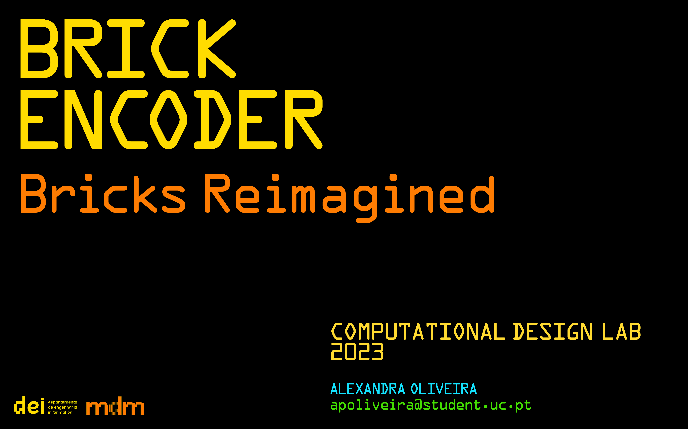
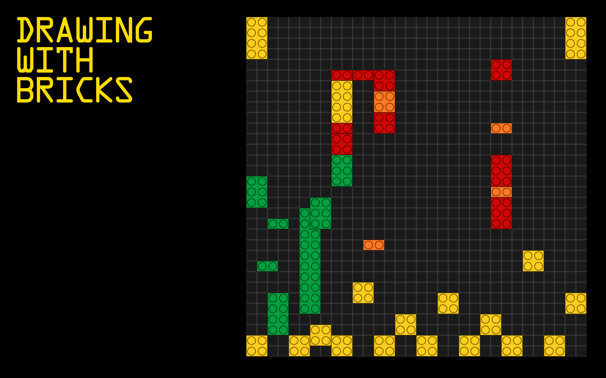
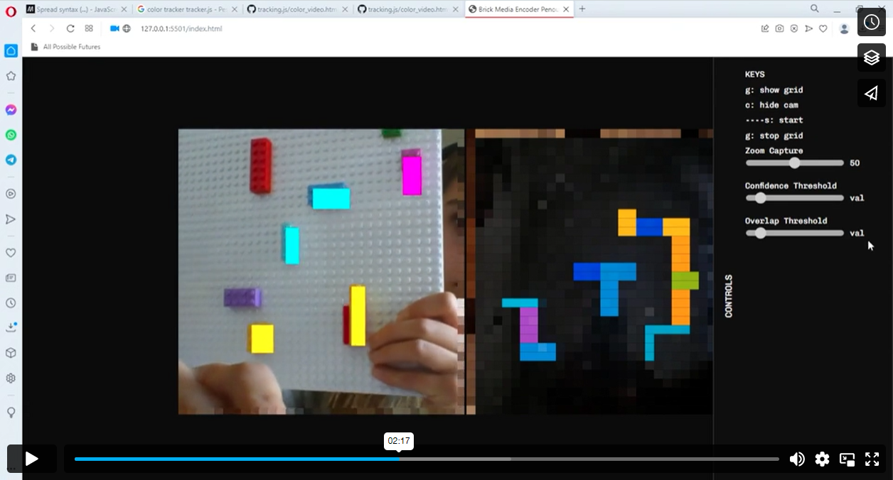

# Brick Encoder
Brick Encoder 
Drawing with bricks

LDC 2022/23

*This is the description*

# Watch the Video

hello 

# Process
### Indesign

### Watch the video

### References

# Credits
This project was created by [Alexandra Oliveira](http://alexandraoliveira.pt/) 
with the guidance and assistance of 
[Tiago Martins](http://cdv.dei.uc.pt/people/tiago-martins/), 
[João M. Cunha](https://cdv.dei.uc.pt/authors/joao-cunha/),
[Pedro Silva](https://cdv.dei.uc.pt/authors/pedro-silva/),
[Penousal Machado](https://cdv.dei.uc.pt/authors/penousal-machado/), and
[Sérgio Rebelo](https://cdv.dei.uc.pt/authors/sergio-rebelo/) 
for the Computational Design Lab course unit of the master's degree in [Design and Multimedia](https://dm.dei.uc.pt) 
(Faculty of Sciences and Technology of the University of Coimbra).

January 2023

(<a href="#readme-top">back to top</a>)

