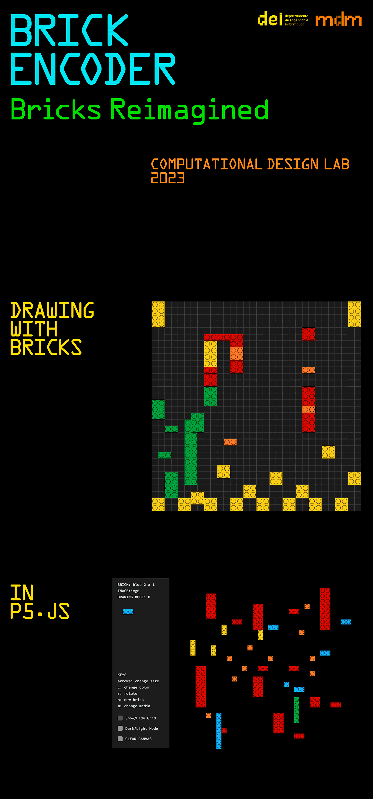

# Structure of code & Process Video
**Digital Legos**
-
This is the main code we developed. It went through several phases and I want to start this one over with functionalities that aid in the type design process. 

Thank you to all professors that guided us in this direction. Digital 2D legos are also cool :)

**Object Detection**
-
This code reflects our attempts at going tangible with legos using object detection.

Thank you to professor Sérgio Rebelo ((👋)) for taking the time to provide this code, allowing us to try out image classification and object detection. We learned a lot, loved the image classification process, and will CERTAINLY use this knowledge (and roboflow) in the future.

**Color Tracking**
-
This code came after the guidance of professor Penousal. We went out and tried tracking.js using professor Sérgio's code as a starting point. We got stuck on the formulas to detect the colors we wanted at trackingColors.js. We gave up! And advanced to the materialization phase with the Digital Legos code.

We still can't implement Brick ⍩⃝ Media Encoder. Who knows in the future!!!

# Credits
This project was created by [Alexandra Oliveira](http://alexandraoliveira.pt/) 
with the guidance and assistance of 
[Tiago Martins](http://cdv.dei.uc.pt/people/tiago-martins/), 
[João M. Cunha](https://cdv.dei.uc.pt/authors/joao-cunha/),
[Pedro Silva](https://cdv.dei.uc.pt/authors/pedro-silva/),
[Penousal Machado](https://cdv.dei.uc.pt/authors/penousal-machado/), and
[Sérgio Rebelo](https://cdv.dei.uc.pt/authors/sergio-rebelo/)
for the Computational Design Lab course unit of the master's degree in [Design and Multimedia](https://dm.dei.uc.pt) 
(Faculty of Sciences and Technology of the University of Coimbra).

January 2023

(<a href="#readme-top">back to top</a>)

